# How to Deploy Bold BI on Azure App Services (Linux-based Container)

This document provides a step-by-step guide to deploy **Bold BI** on **Azure App Services** using a **Linux-based container** via an ARM (Azure Resource Manager) template.

---

## Prerequisites

1. An active **Azure subscription** with **Contributor** access.
2. A valid **Bold BI license** (optional for trial deployment).
3. A supported **database server**.
   - Microsoft SQL Server 2016+
   - PostgreSQL 13.0+
   - MySQL 8.0+
   - Oracle Database 19c+
4. A modern web browser to access the **Azure Portal**.
   - Microsoft Edge
   - Mozilla Firefox
   - Chrome

---

## Deployment Steps

### Step 1: Sign in to the Azure Portal

1. Open your browser and navigate to the [Azure Portal](https://portal.azure.com).
2. Log in with your Azure account credentials.

---

### Step 2: Open the Custom Template Deployment

1. In the Azure Portal **search bar**, type **`Deploy a custom template`**.
2. From the results, select **Deploy a custom template** (under *Marketplace* or *Services*).

    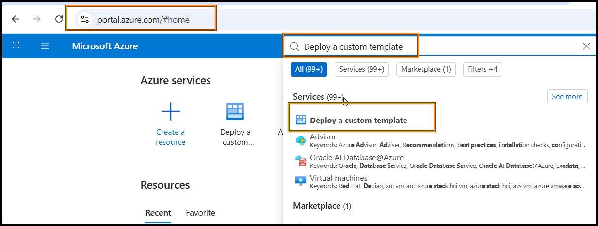

---

### Step 3: Build Your Own Template

1. On the deployment page, choose the **Build your own template in the editor** option.
  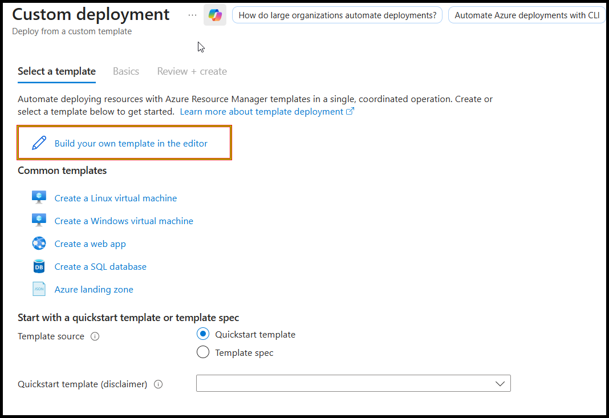

2. Click the **▶ Click here to expand the ARM template** section below, then copy the JSON and paste it into the editor.
  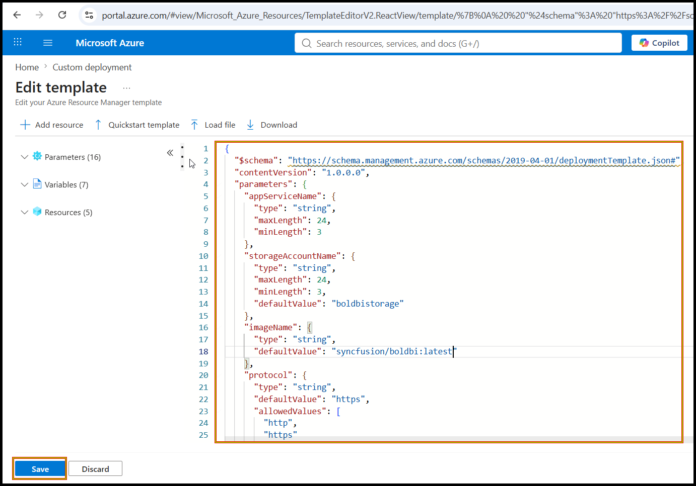

3. Click **Save + Continue**.

<details>
<summary> Click here to expand the ARM template</summary>

```json
{
  "$schema": "https://schema.management.azure.com/schemas/2019-04-01/deploymentTemplate.json#",
  "contentVersion": "1.0.0.0",
  "parameters": {
    "appServiceName": {
      "type": "string",
      "maxLength": 24,
      "minLength": 3
    },
    "storageAccountName": {
      "type": "string",
      "maxLength": 24,
      "minLength": 3,
      "defaultValue": "boldbistorage"
    },
    "imageName": {
      "type": "string",
      "defaultValue": "asme123/boldbi:azure_app_services_images4"
    },
    "protocol": {
      "type": "string",
      "defaultValue": "https",
      "allowedValues": [
        "http",
        "https"
      ]
    },
    "appServicePlanSize": {
      "type": "string",
      "defaultValue": "P1V3_2Core_8GB_DEV",
      "allowedValues": [
        "P1V3_2Core_8GB_DEV",
        "P2V3_4Core_16GB_PROD",
        "P3V3_8Core_32GB_PROD"
      ]
    },
    "unlockKey": {
      "type": "secureString",
      "defaultValue": "",
      "metadata": {
        "description": "Bold BI unlock/license key"
      }
    },
    "userEmail": {
      "type": "string",
      "defaultValue": "",
      "metadata": {
        "description": "Initial admin user email"
      }
    },
    "userPassword": {
      "type": "secureString",
      "defaultValue": "",
      "metadata": {
        "description": "Initial admin user password"
      }
    },
    "databaseServerType": {
      "type": "string",
      "defaultValue": "",
      "metadata": {
        "description": "Database server type"
      }
    },
    "databaseHost": {
      "type": "string",
      "defaultValue": "",
      "metadata": {
        "description": "Database host"
      }
    },
    "databasePort": {
      "type": "string",
      "defaultValue": "",
      "metadata": {
        "description": "Database port"
      }
    },
    "databaseUser": {
      "type": "string",
      "defaultValue": "",
      "metadata": {
        "description": "Database user"
      }
    },
    "databasePassword": {
      "type": "secureString",
      "defaultValue": "",
      "metadata": {
        "description": "Database password"
      }
    },
    "databaseName": {
      "type": "string",
      "defaultValue": "",
      "metadata": {
        "description": "Database name"
      }
    },
    "postgresMaintenanceDatabase": {
      "type": "string",
      "defaultValue": "postgres",
      "metadata": {
        "description": "PostgreSQL maintenance database"
      }
    },
    "databaseAdditionalParameters": {
      "type": "string",
      "defaultValue": "",
      "metadata": {
        "description": "Additional connection parameters"
      }
    }
  },
  "variables": {
    "planName": "[concat(parameters('appServiceName'), '-plan')]",
    "workspaceName": "[concat(parameters('appServiceName'), '-logs')]",
    "httpsOnly": "[equals(parameters('protocol'), 'https')]",
    "azureAppServicesHttps": "[if(equals(parameters('protocol'), 'https'), 'true', 'false')]",
    "planSkuMap": {
      "P1V3_2Core_8GB_DEV": "P1v3",
      "P2V3_4Core_16GB_PROD": "P2v3",
      "P3V3_8Core_32GB_PROD": "P3v3"
    },
    "skuName": "[variables('planSkuMap')[parameters('appServicePlanSize')]]",
    "dockerImage": "[concat('DOCKER|', parameters('imageName'))]"
  },
  "resources": [
    {
      "type": "Microsoft.Storage/storageAccounts",
      "apiVersion": "2023-01-01",
      "name": "[parameters('storageAccountName')]",
      "location": "[resourceGroup().location]",
      "sku": {
        "name": "Standard_LRS"
      },
      "kind": "StorageV2",
      "properties": {}
    },
    {
      "type": "Microsoft.OperationalInsights/workspaces",
      "apiVersion": "2023-09-01",
      "name": "[variables('workspaceName')]",
      "location": "[resourceGroup().location]",
      "properties": {
        "sku": {
          "name": "PerGB2018"
        },
        "retentionInDays": 30
      }
    },
    {
      "type": "Microsoft.Web/serverfarms",
      "apiVersion": "2023-12-01",
      "name": "[variables('planName')]",
      "location": "[resourceGroup().location]",
      "kind": "linux",
      "sku": {
        "name": "[variables('skuName')]",
        "tier": "PremiumV3",
        "capacity": 1
      },
      "properties": {
        "reserved": true
      }
    },
    {
      "type": "Microsoft.Web/sites",
      "apiVersion": "2023-12-01",
      "name": "[parameters('appServiceName')]",
      "location": "[resourceGroup().location]",
      "kind": "app,linux,container",
      "dependsOn": [
        "[resourceId('Microsoft.Web/serverfarms', variables('planName'))]",
        "[resourceId('Microsoft.Storage/storageAccounts', parameters('storageAccountName'))]"
      ],
      "properties": {
        "serverFarmId": "[resourceId('Microsoft.Web/serverfarms', variables('planName'))]",
        "httpsOnly": "[variables('httpsOnly')]",
        "siteConfig": {
          "linuxFxVersion": "[variables('dockerImage')]",
          "alwaysOn": true,
          "healthCheckPath": "/api/status",
          "healthCheckEvictionTimeInMin": 2,
          "appSettings": [
            {
              "name": "AZURE_APP_SERVICES_HTTPS",
              "value": "[variables('azureAppServicesHttps')]"
            },
            {
              "name": "APP_URL",
              "value": "[concat(parameters('protocol'), '://', parameters('appServiceName'), '.azurewebsites.net')]"
            },
            {
              "name": "WEBSITES_PORT",
              "value": "80"
            },
            {
              "name": "BOLD_SERVICES_AZUREBLOB_ACCESSKEY",
              "value": "[listKeys(resourceId('Microsoft.Storage/storageAccounts', parameters('storageAccountName')), '2023-01-01').keys[0].value]"
            },
            {
              "name": "BOLD_SERVICES_AZUREBLOB_ACCOUNT_NAME",
              "value": "[parameters('storageAccountName')]"
            },
            {
              "name": "BOLD_SERVICES_AZUREBLOB_CONNECTION_TYPE",
              "value": "https"
            },
            {
              "name": "BOLD_SERVICES_AZUREBLOB_STORAGE_URI",
              "value": "[concat(parameters('storageAccountName'), '.blob.core.windows.net')]"
            },
            {
              "name": "BOLD_SERVICES_STORAGETYPE",
              "value": "1"
            },
            {
              "name": "BOLD_SERVICES_AZUREBLOB_CONTAINER_NAME",
              "value": "bold-services"
            },
            {
              "name": "BOLD_SERVICES_CONSOLE_LOG_ENABLED",
              "value": "true"
            },
            {
              "name": "BOLD_SERVICES_UNLOCK_KEY",
              "value": "[parameters('unlockKey')]"
            },
            {
              "name": "BOLD_SERVICES_DB_TYPE",
              "value": "[parameters('databaseServerType')]"
            },
            {
              "name": "BOLD_SERVICES_DB_HOST",
              "value": "[parameters('databaseHost')]"
            },
            {
              "name": "BOLD_SERVICES_DB_PORT",
              "value": "[parameters('databasePort')]"
            },
            {
              "name": "BOLD_SERVICES_DB_USER",
              "value": "[parameters('databaseUser')]"
            },
            {
              "name": "BOLD_SERVICES_DB_PASSWORD",
              "value": "[parameters('databasePassword')]"
            },
            {
              "name": "BOLD_SERVICES_DB_NAME",
              "value": "[parameters('databaseName')]"
            },
            {
              "name": "BOLD_SERVICES_POSTGRESQL_MAINTENANCE_DB",
              "value": "[parameters('postgresMaintenanceDatabase')]"
            },
            {
              "name": "BOLD_SERVICES_DB_ADDITIONAL_PARAMETERS",
              "value": "[parameters('databaseAdditionalParameters')]"
            },
            {
              "name": "BOLD_SERVICES_USER_EMAIL",
              "value": "[parameters('userEmail')]"
            },
            {
              "name": "BOLD_SERVICES_USER_PASSWORD",
              "value": "[parameters('userPassword')]"
            }
          ]
        }
      }
    },
    {
      "type": "Microsoft.Insights/diagnosticSettings",
      "apiVersion": "2021-05-01-preview",
      "name": "appservice-diagnostics",
      "scope": "[resourceId('Microsoft.Web/sites', parameters('appServiceName'))]",
      "dependsOn": [
        "[resourceId('Microsoft.Web/sites', parameters('appServiceName'))]",
        "[resourceId('Microsoft.OperationalInsights/workspaces', variables('workspaceName'))]"
      ],
      "properties": {
        "workspaceId": "[resourceId('Microsoft.OperationalInsights/workspaces', variables('workspaceName'))]",
        "logs": [
          {
            "category": "AppServiceConsoleLogs",
            "enabled": true
          },
          {
            "category": "AppServiceHTTPLogs",
            "enabled": true
          },
          {
            "category": "AppServiceAppLogs",
            "enabled": true
          },
          {
            "category": "AppServicePlatformLogs",
            "enabled": true
          },
          {
            "category": "AppServiceAuditLogs",
            "enabled": true
          }
        ],
        "metrics": [
          {
            "category": "AllMetrics",
            "enabled": true
          }
        ]
      }
    }
  ]
}
```

</details>
---

### Step 4: Fill in Deployment Details

Provide the following parameters:

#### Mandatory (always required)

| Parameter | Description |
|------------|-------------|
| **Subscription** | Choose your Azure subscription. |
| **Resource group** | Select an existing resource group or create a new one. |
| **Region** | Choose the Azure region for deployment. |
| **App Service Name** | Enter a unique name for the Bold BI App URL (3–24 characters, lowercase letters and numbers only). If taken, the deployment fails — choose another. |
| **App Service Plan Size** | Select the App Service SKU. Available values: <br>• `P1V3_2Core_8GB_DEV` <br>• `P2V3_4Core_16GB_PROD` <br>• `P3V3_8Core_32GB_PROD` |
| **Storage Account Name** | Unique name (3–24 characters, lowercase letters and numbers only) for Blob storage. |
| **Protocol** | Choose the protocol used to host Bold BI. <br>• Select `http` if you want to host Bold BI over **HTTP** (e.g., `http://<appname>.azurewebsites.net`). <br>• Select `https` if you want to host Bold BI over **HTTPS** (e.g., `https://<appname>.azurewebsites.net`). <br> Make sure the protocol you select here matches how you will access the application later. |
| **Image Name** | The Bold BI Docker image to deploy. <br>• **Default value:** `asme123/boldbi:azure_app_services_images4` <br>• If you have any other Bold BI image, update this value here. <br> Example format: `<repository>/<image>:<tag>`. |

  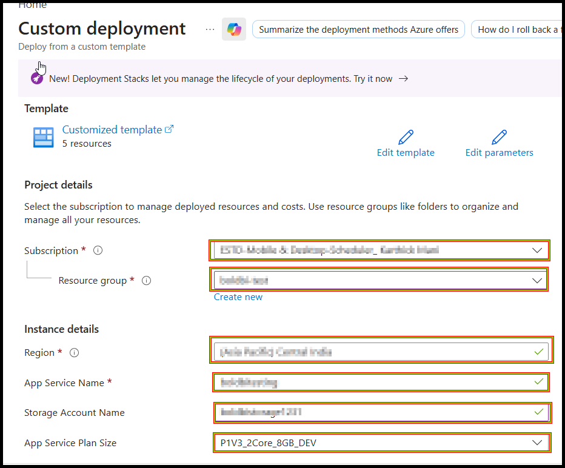

#### Required for Auto-Deployment Mode

> Provide these parameters to enable full automatic configuration of database connection and admin user (no manual steps required after deployment).

| Parameter | Description |
|------------|-------------|
| **User Email** | Initial administrator email address. |
| **User Password** | Admin password. The password must meet the following requirements: <br>• At least **6 characters** <br>• Includes **1 uppercase** letter <br>• Includes **1 lowercase** letter <br>• Includes **1 numeric** character <br>• Includes **1 special** character |

#### Database Configuration

| Parameter | Description |
|------------|-------------|
| **Database Server Type** | Choose one: `mssql`, `postgresql`, `mysql`, or `oracle`. |
| **Database Host** | Database server hostname or endpoint. |
| **Database User** | Database username. |
| **Database Password** | Database password. |

#### Optional / Additional Database Parameters

> Only required in specific cases.

| Parameter | Description |
|------------|-------------|
| **Database Port** | Database port (optional; defaults based on server type). |
| **Postgres Maintenance Database** | For PostgreSQL servers. The system uses `postgres` by default. Provide a different value if your server uses a different default database. |
| **Database Name** | Existing database name. If omitted, Bold BI creates `bold_services`. |
| **Database Additional Parameters** | Additional connection string parameters if required. See official docs: <br>• [MySQL](https://dev.mysql.com/doc/connector-net/en/connector-net-8-0-connection-options.html) <br>• [PostgreSQL](https://www.npgsql.org/doc/connection-string-parameters.html) <br>• [MS SQL](https://learn.microsoft.com/en-us/dotnet/api/system.data.sqlclient.sqlconnection.connectionstring?view=netframework-4.8.1) <br>• [Oracle](https://docs.oracle.com/en/database/oracle/oracle-database/19/odpnt/ConnectionConnectionString.html) |

#### Optional Licensing & Activation

> Not required for deployment; defaults allow trial or manual activation post-deployment.

| Parameter | Description |
|------------|-------------|
| **Unlock Key** | Bold BI license key. |

---

### Step 5: Review and Create

1. After all details are filled in, click **Review + Create**.
  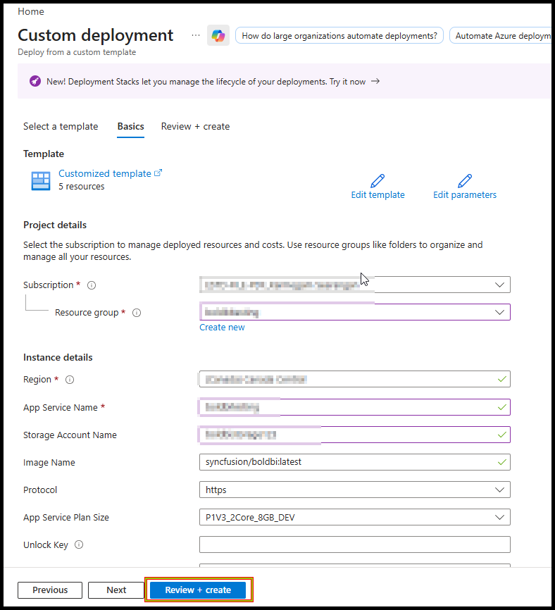

2. Wait for validation to complete.

3. Click **Create** to begin the deployment.

---

### Step 6: Wait for Resources to Be Created

1. Once the deployment finishes, click **Go to resource group**.
  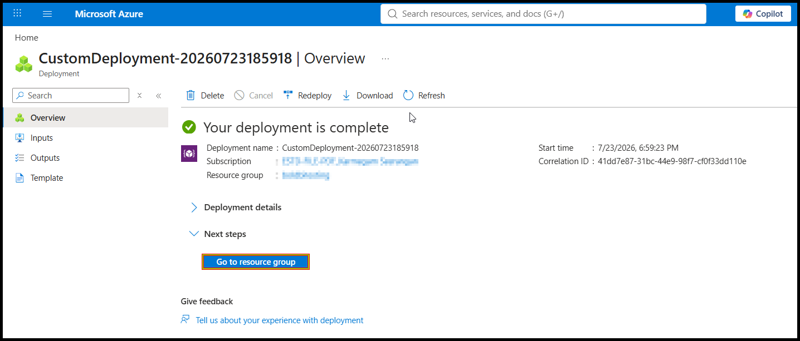

2. From the resource group, select the **App Service**.
  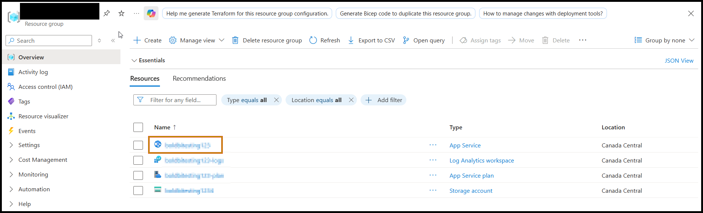
---

### Step 7: Wait for the Site to Be Healthy

1. Wait approximately **10 minutes** for the site to come up and run.
2. On the **Overview** page, check the **Health Check** status:
   - `Health Check: 100.00% (Healthy 1 / Degraded 0)` indicates the site is healthy.
   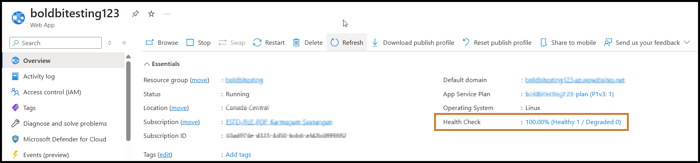

---

### Step 8: Access the Bold BI Application

1. On the **Overview** page, copy the **Default Domain** URL.
  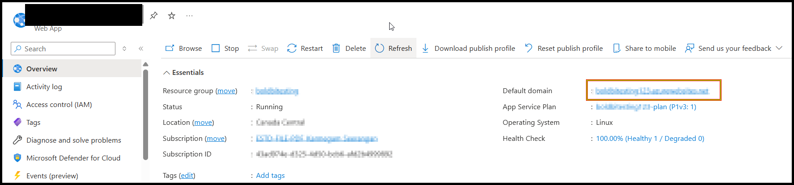

2. Paste the URL into your browser.

> **Note:**
> - If you chose **HTTP**, access the site via `http://<Default Domain>`.
> - If you chose **HTTPS**, access the site via `https://<Default Domain>`.
>
> Wait for some time for it to load completely before proceeding.

---

### Step 9: Start the Bold BI Application

After accessing the Bold BI site, follow the application startup guide: [https://help.boldbi.com/application-startup/](https://help.boldbi.com/application-startup/)

---

## How to Install Client Libraries for Bold BI in Azure App Service

To install additional **client libraries** (e.g., MongoDB, ClickHouse, Google BigQuery, etc.) for Bold BI:

1. Navigate to **App Service** → **Settings** → **Environment variables**.
2. Click the **+ Add** button to add a new environment variable.
  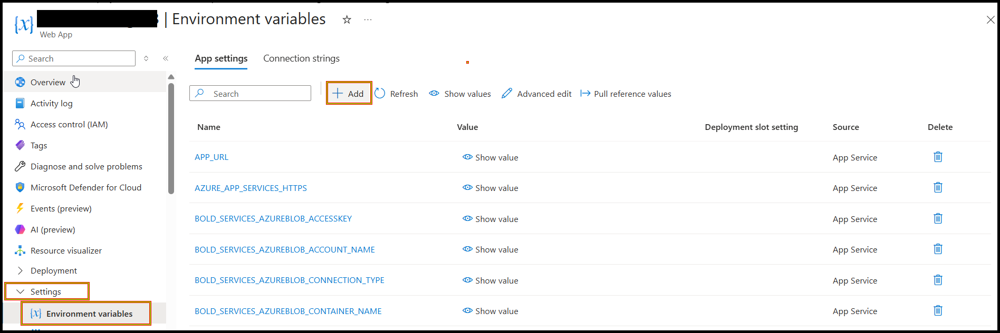

3. Set the environment variable as follows:
   - **Name:** `OPTIONAL_LIBS`
   - **Value:** `mongodb,mysql,influxdb,snowflake,oracle,clickhouse,google`
  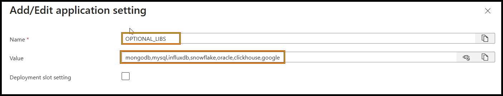

   - **Default client libraries included in Bold BI:**
    `mongodb, mysql, influxdb, snowflake, oracle, clickhouse, google` For more details, refer to the official documentation: [Consent to Deploy Client Libraries](https://github.com/boldbi/boldbi-server-in-docker/blob/main/docs/consent-to-deploy-client-libraries.md)

4. Click **Apply** / **Save** to apply the changes.
5. Restart the App Service for the new libraries to take effect.

---

## How to Upgrade Bold BI Docker Images

To upgrade the Bold BI version running on your Azure App Service:

1. Navigate to **App Service** → **Deployment** → **Deployment Center** → **Container**.
2. In the **Image and tag** field, update the value with the new Bold BI image name and tag.
3. Click **Save** at the top of the page.
  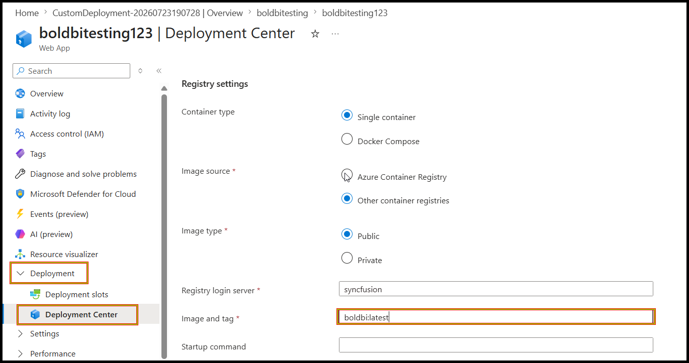

4. Wait approximately **10 minutes** for the new Docker image to be pulled and the site to come up.
5. To monitor the upgrade progress, Navigate to **App Service** → **Deployment** → **Deployment Center** → **Logs**.
  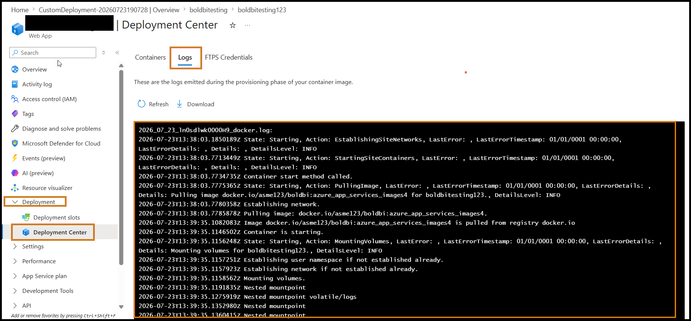

---

## Troubleshooting

### 1. Health Check Not Reaching 100%

If the health check is not up and running at 100% after 10 minutes:

1. Navigate to **App Service** → **Deployment** → **Deployment Center** → **Logs**.
2. Review the **platform-level logs** to identify the issue (image pull failures, container startup errors, etc.).
  

---

### 2. Application-Level Issues

If you encounter issues at the **Bold BI application level**:

1. Navigate to **App Service** → **Monitoring** → **Logs**.
2. Under **Tables**, select `AppServiceConsoleLogs`.
  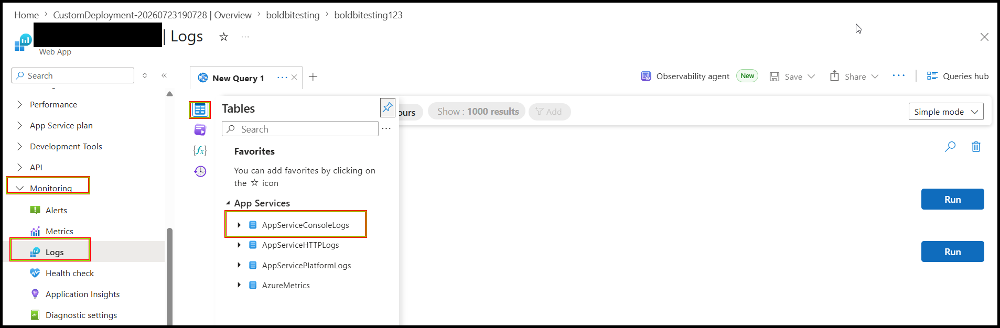
  
3. Review the application-level logs to diagnose the problem.
  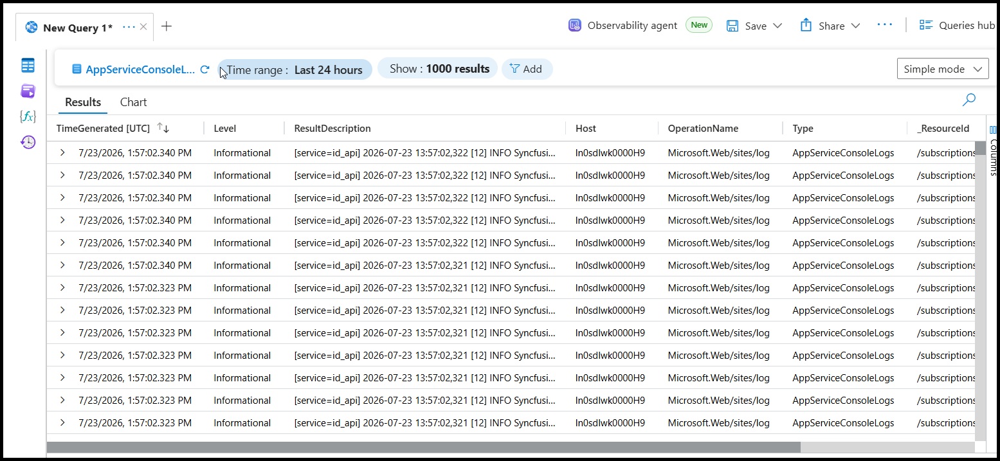
---

## Quick Reference: Useful Links

| Resource | Link |
|----------|------|
| Azure Portal | [https://portal.azure.com](https://portal.azure.com) |
| Bold BI Application Startup | [https://help.boldbi.com/application-startup/](https://help.boldbi.com/application-startup/) |
| Client Libraries Documentation | [GitHub - boldbi-server-in-docker](https://github.com/boldbi/boldbi-server-in-docker/blob/main/docs/consent-to-deploy-client-libraries.md) |
| MS SQL Connection String | [Microsoft Docs](https://learn.microsoft.com/en-us/dotnet/api/system.data.sqlclient.sqlconnection.connectionstring?view=netframework-4.8.1) |
| PostgreSQL Connection String | [Npgsql Docs](https://www.npgsql.org/doc/connection-string-parameters.html) |
| MySQL Connection Options | [MySQL Docs](https://dev.mysql.com/doc/connector-net/en/connector-net-8-0-connection-options.html) |
| Oracle Connection String | [Oracle Docs](https://docs.oracle.com/en/database/oracle/oracle-database/19/odpnt/ConnectionConnectionString.html) |

---

## Summary

This guide covers the complete workflow to:

- Deploy **Bold BI** on **Azure App Services** using a Linux container.
- Install **client libraries** via environment variables.
- Upgrade the Bold BI Docker image when a new version is available.
- Troubleshoot common deployment and runtime issues.

