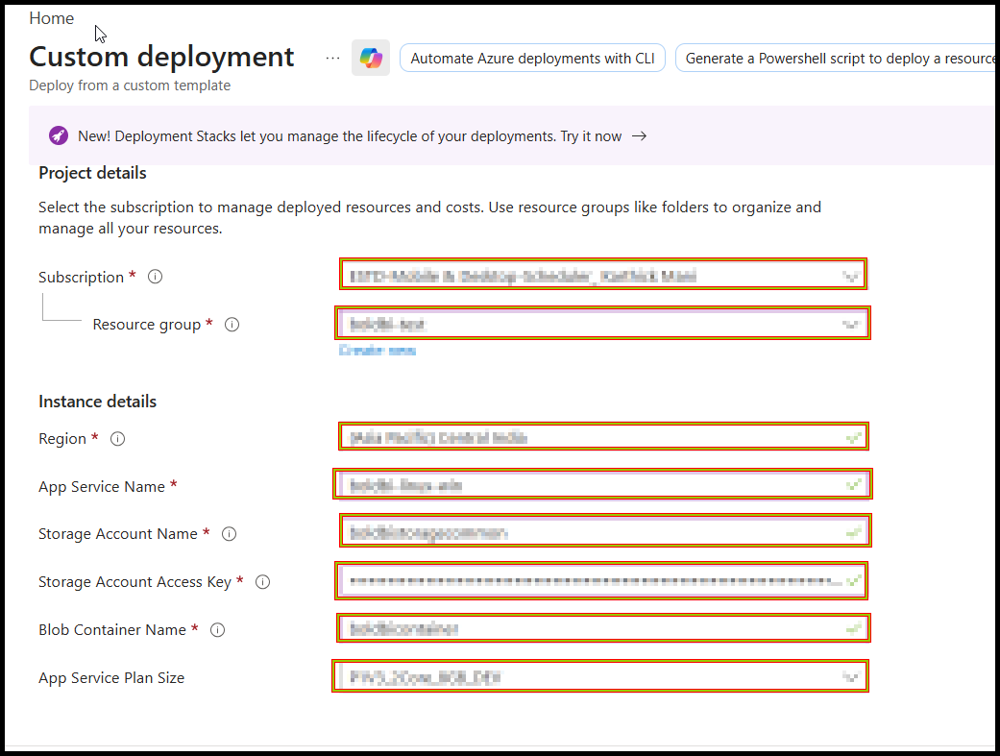
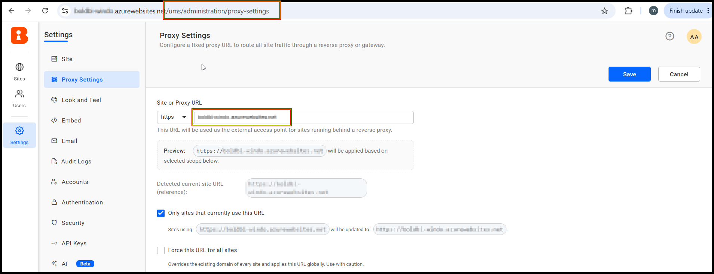

# How to Deploy Bold BI on Azure App Services (Linux Container) with an Existing Storage Account

This guide explains how to deploy **Bold BI** on **Azure App Services (Linux container)** while reusing the **existing Azure Storage Account** that was originally used with the **Windows-based App Service**.

> If you previously hosted Bold BI on an Azure App Service for Windows, you can keep using the same storage account — the Linux container will connect to it using the same connection details.

---

## Prerequisites

1. You must already have a working **Bold BI deployment on Azure App Service (Windows)**. If you have not deployed it yet, follow the Azure App Service [deployment guide](https://help.boldbi.com/deploying-bold-bi/deploying-on-azure-app-service/)

   - Before creating the new **Linux Container-based Azure App Service**, stop the existing Windows-based Azure App Service to avoid conflicts and unnecessary resource usage.

   - After the Linux Container deployment is completed and your Bold BI site is verified to be working correctly, you can either keep the Windows-based App Service as a backup or delete it if it is no longer required.
2. Collect the details from the **old storage account**:
   - Storage account name
   - Storage account access key
   - Azure Blob container name
4. You have an **Azure subscription** with permission to deploy resources, and an existing **resource group** to deploy into.

---

## Deployment Steps

### Step 1: Sign in to the Azure Portal

1. Open your browser and navigate to the [Azure Portal](https://portal.azure.com).
2. Log in with your Azure account credentials.

---

### Step 2: Open the Custom Template Deployment

1. In the Azure Portal **search bar**, type **`Deploy a custom template`**.
2. From the results, select **Deploy a custom template** (under *Marketplace* or *Services*).

    

---

### Step 3: Build Your Own Template

1. On the deployment page, choose the **Build your own template in the editor** option.
   

2. Open the [ARM template JSON file](../arm-template/boldbi-appservice.json), copy the entire JSON content, and paste it into the editor.
   

3. Click **Save + Continue**.

---

### Step 4: Fill in Deployment Details

Provide the following parameters:

#### Mandatory (always required)

| Parameter | Description |
|------------|-------------|
| **Subscription** | Choose your Azure subscription. |
| **Resource group** | Select an existing resource group or create a new one. |
| **Region** | Choose the Azure region for deployment. The storage account, app service plan, and app service should all be in the same region. |
| **App Service Name** | Enter a unique name for the Bold BI App URL (3–24 characters, lowercase letters and numbers only). If the name is already taken, the deployment fails — choose another. |
| **App Service Plan Size** | Select the App Service SKU. Available values:  • `P1V3_2Core_8GB_DEV`  • `P2V3_4Core_16GB_PROD`  • `P3V3_8Core_32GB_PROD` |
| **Storage Account Name** | The name of the **existing** storage account that was previously used with the Windows-based App Service. |
| **Storage Account Access Key** | The **access key** of the existing storage account. Find it under the storage account → *Security + networking* → *Access keys*. |
| **Azure Blob Container Name** | The name of the **existing** blob container in the storage account (for example, `bold-services`). |

  

---

### Step 5: Review and Create

1. After all details are filled in, click **Review + Create**.

2. Wait for validation to complete.

3. Click **Create** to begin the deployment.

---

### Step 6: Wait for Resources to Be Created

1. Once the deployment finishes, click **Go to resource group**.
  

2. From the resource group, select the **App Service**.
  
---

### Step 7: Wait for the Site to Be Healthy

1. Wait approximately **10 minutes** for the site to come up and run.
2. On the **Overview** page, check the **Health Check** status:
   - `Health Check: 100.00% (Healthy 1 / Degraded 0)` indicates the site is healthy.
   

---

### Step 8: Access the Bold BI Application

1. On the **Overview** page, copy the **Default Domain** URL.

   

2. Open a browser and navigate to the following URL by appending `/ums/administration/proxy-settings` to the **Default Domain**:

3. If you are redirected to the Bold BI login page, sign in using your Bold BI username and password.

4. After accessing the **Proxy Settings** page, update the **Site URL** or **Proxy URL** field with your new domain URL.
   
---

